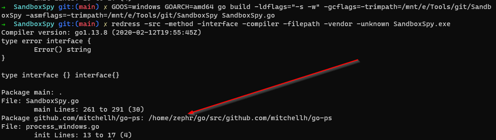
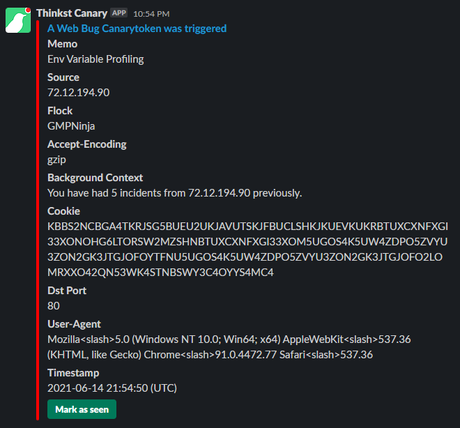
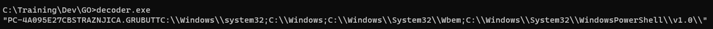

# SandboxSpy

(It only has a logo as I got bored in MSPAINT)

Initially an idea to profile sandboxes, the code is written to take enviromental variables and send them back in a Base32 string over HTTP to an endpoint.

The primary goal is to understand if we're in a sandbox or not based on the path and domain/username. Eventual plans are to build out blacklists of information to build into our C2 and malware development.

# Setup
In order to compile you'll need to get `github.com/mitchellh/go-ps` this can be done by doing:

```go
go get github.com/mitchellh/go-ps
```

# What stuff is
- SandBoxSpy.go - This is the main tool
- decoder.go - Takes the Base32 string and decodes it, pass in an example:

```cmd
decoder.exe O5UW4LLWOVQTM4DPOV3DK5LQLRVG62DOBUFFOSKOFVLFKQJWKBHVKVRVKVIA2CSXJFHC2VSVIE3FAT2VKY2VKUCKN5UG4QZ2LRIHE33HOJQW2ICGNFWGK424KB4XI2DPNYZTMXDMNFRFY43JORSS24DBMNVWCZ3FONOHA6LXNFXDGMS7ON4XG5DFNUZTEO2DHJOFA4TPM5ZGC3JAIZUWYZLTEAUHQOBWFFOFO2LOMRXXO4ZAKJSXG33VOJRWKICLNF2HGXCUN5XWY424HNBTUXCQOJXWO4TBNUQEM2LMMVZVYUDZORUG63RTGZOFGY3SNFYHI424HNBTUXCQOJXWO4TBNUQEM2LMMVZVYUDZORUG63RTGZODWQZ2LRLWS3TEN53XGXDTPFZXIZLNGMZDWQZ2LRLWS3TEN53XGO2DHJOFO2LOMRXXO424KN4XG5DFNUZTEXCXMJSW2O2DHJOFO2LOMRXXO424KN4XG5DFNUZTEXCXNFXGI33XONIG653FOJJWQZLMNROHMMJOGBODWYZ2LRYHS5DIN5XDENZ3MM5FYV3JNZSG653TLRJXS43XN53TMNB3IM5FYVLTMVZHGXCKN5UG4XCBOBYEIYLUMFOEY33DMFWFYTLJMNZG643PMZ2FYV3JNZSG653TIFYHA4Z3
```
Output:
```cmd
"win-vua6pouv5up\\john\r\nWIN-VUA6POUV5UP\r\nWIN-VUA6POUV5UPJohnC:\\Program Files\\Python36\\lib\\site-packages\\pywin32_system32;C:\\Program Files (x86)\\Windows Resource Kits\\Tools\\;C:\\Program Files\\Python36\\Scripts\\;C:\\Program Files\\Python36\\;C:\\Windows\\system32;C:\\Windows;C:\\Windows\\System32\\Wbem;C:\\Windows\\System32\\WindowsPowerShell\\v1.0\\;c:\\python27;c:\\Windows\\Syswow64;C:\\Users\\John\\AppData\\Local\\Microsoft\\WindowsApps;"
```

# Setup and Install
The setup is fairly easy, just compile for windows and specify what URL you want to call back to.
#### OPSEC NOTE: Package github.com/mitchellh/go-ps: this will output your go path, I'm trying to work out how to remove this soon!


### 64 Bit


```go
GOOS=windows GOARCH=amd64 go build -ldflags="-s -w -H=windowsgui" -gcflags=-trimpath=/path/to/SandboxSpy -asmflags=-trimpath=/path/to/SandboxSpy SandboxSpy.go
```

### 32 Bit

```go
GOOS=windows GOARCH=386 go build -ldflags="-s -w -H=windowsgui" -gcflags=-trimpath=/path/to/SandboxSpy -asmflags=-trimpath=/path/to/SandboxSpy SandboxSpy.go
```

## Running the Thing
As it's a command line binary, simply running it on an endpoint or uploading to a target system is the sole intention. The binary itself is benign and can be obfuscated with gobfuscate if you wish. 

```
./SandBoxSpy.exe or upload
```

## Example Output/Callback
An example of what it sends back can be seen below(Taken from canary token and virus total). The example is using canary console slack plugin but it'll send back just the cookie header if using a standard web server.



Decoded output from decoder.exe:



## Interesting Processes From Sandboxes
Going to update this list with interesting processes spawned inside sandboxes, so we can build better malware.

- srvhost.exe - Any.run process

